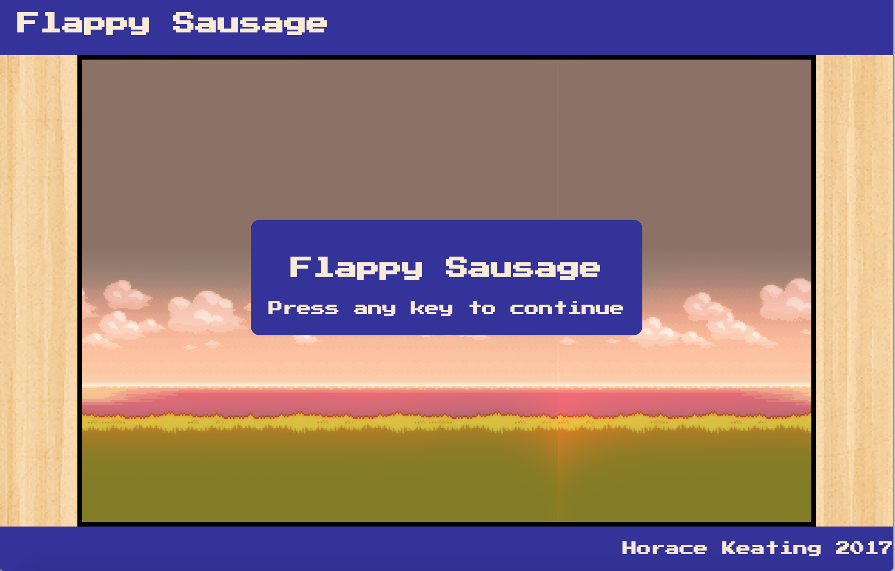
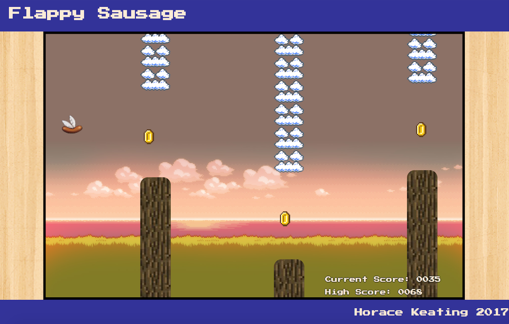
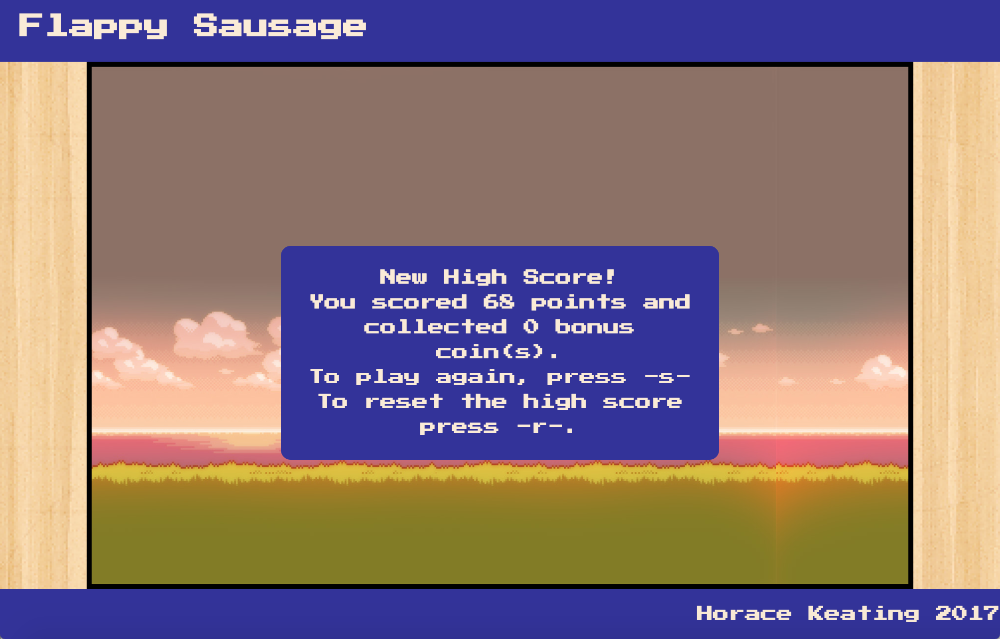

#wdi-project-1
---
###Flappy Sausage

###Introduction

Flappy Sausage is a one player game based on the popular Flappy Bird and Helicopter games in which the player attempts to survive for as long as possible while avoiding randomly generated obstacles. This game was built using Javascript for my first project on General Assembly's Web Development Immersive course. You can view the game code [here](https://github.com/HKeating/wdi-project-1).

###Instructions

When the game loads, the player is invited to begin by pressing any key. This takes you to the starting menu, pressing 's' will begin the game. This generates a sausage on the left hand side of the game board, and the first set of obstacles on the right. The sausage will begin falling to the ground and the obstacles move from right to left, towards the sausage. The player uses the spacebar to make the sausage jump to avoid hitting the ground and to fly through the gap between the top and bottom obstacles.

Points are gained over time, the longer you survive, the more points you receive. You can gain an additional 25 points each time you hit one of the coins that are generated along with the obstacles 50% of the time.

The game lasts until the sausage hits either the ground or an obstacle. This brings up the game over screen which informs the player how many points they scored, how many bonus coins they hit, and whether they got a new high score. You can start a new game by pressing 's', or reset the high score by pressing 'r'.

###Project Brief

- Create a game utilising our 2 weeks of knowledge on HTML, CSS and JavaScript.
- Create a two player game or a computer opponent to beat.
- Build the game using object orientated programming if possible.

###How I built it

Flappy Sausage was built using HTML, CSS and Javascript, as well as the following:

  - [jQuery](https://code.jquery.com/)
  - [Google fonts](https://fonts.google.com/)
  - [Animate.css](https://daneden.github.io/animate.css/)
  - [javascript easings](http://gsgd.co.uk/sandbox/jquery/easing/)

###Possible future features

  - Responsive design
  - Improved menu flow including difficulty settings, mute option, and menu navigation with arrow keys
  - Persistent high score table

###Additional credits:

  - [Background image](http://www.imgbase.info/images/safe-wallpapers/miscellaneous/8_bit/42845_8_bit.jpg)
  - [Original sausage image](https://www.spoonflower.com/giftwrap/3928149-sausage-wings-by-interrobangart)
  - [Clouds obstacle](https://toe.prx.org/2013/05/toe-03-the-clouds-part-three/)
  - [Jump sound](https://opengameart.org/content/8-bit-jump-1), [coin sound](https://freesound.org/people/timgormly/sounds/170147/), [squelch](https://www.youtube.com/watch?v=rzhjY4ETXdA)
  - Thanks to GA instructors Alex Chin and Rane Gowan, and TAs Nat Huitson and Ed Compton
